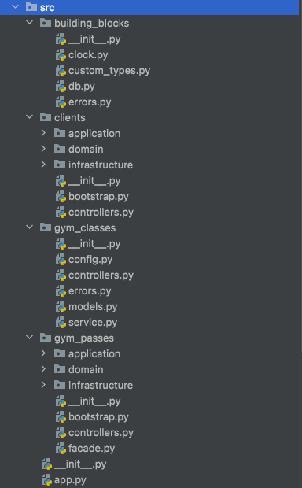

# hexagonal-architecture-python

[](https://www.python.org/)

This project was created as an example for my blog post https://blog.szymonmiks.pl/p/hexagonal-architecture-in-python/

I encourage you to read the article first before checking the code.

This is for educational purposes only and the code is not production-ready.

## Intro

I created a project that uses FastAPI and follows the hexagonal architecture rules.

This project is a simplified gym management software. We have such functionalities like:
- Gym Clients
  - create a gym client
  - change client's personal data
  - archive a client
  - export all clients as a CSV or JSON file to S3 or Dropbox storage
- Gym Passes
  - create a gym pass
  - pause a gym pass
  - renew a gym pass
  - check if gym pass is active
- Gym Classes (CRUD)
  - create a gym class
  - delete a gym class
  - modify a gym class
  - list all gym classes sorted by time and day of the week

## Project structure



## Stack

- Python 3.10
- FastAPI
- MongoDB

## Prerequisites

Make sure you have installed all the following prerequisites on your development machine:

- [Python 3.9](https://www.python.org/downloads/)
- [Poetry](https://python-poetry.org/)
- [GIT](https://git-scm.com/downloads)
- [Make](http://gnuwin32.sourceforge.net/packages/make.htm)
- [Docker version >= 20.10.7](https://www.docker.com/get-started)
- [docker-compose version >= 1.29.2](https://docs.docker.com/compose/install/)

## Setup

1. Install dependencies:

```bash
$ poetry install
```

2. Setup pre-commit hooks before committing:

```bash
$ poetry run pre-commit install
```

## Running app locally

1. In the main project's directory create a new `.env` file and copy all variables from `example.env` there.
2. Run `docker-compose up -d`
3. Go to `src/app.py` and run the app

## Tests


```bash
$ poetry run pytest
```

or

```bash
$ make tests
```
